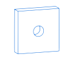
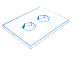
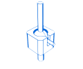

# Kresling_CadQuery
This repository discusses the use of the python library Cadquery to create Kresling units and Kresling arrays.

## CadQuery 
CadQuery is an open-source, easy-to-use Python library for building parametric 3D CAD models.

Here are presented three examples to see the use of CadQuery as a powerful yet simple object oriented library. 

#### Example 1 : Box 
```python
thickness = 0.5
width = 2.0
result = Workplane("front").box(width, width, thickness).faces(">Z").hole(thickness)
```


#### Example 2 : Polygons 
```python
result = (
    cq.Workplane("front")
    .box(3.0, 4.0, 0.25)
    .pushPoints([(0, 0.75), (0, -0.75)])
    .polygon(6, 1.0)
    .cutThruAll()
)
```


#### Example 3 : Spherical joints 
```python
import cadquery as cq

sphere = cq.Workplane().sphere(5)
base = cq.Workplane(origin=(0, 0, -2)).box(12, 12, 10).cut(sphere).edges("|Z").fillet(2)
sphere_face = base.faces(">>X[2] and (not |Z) and (not |Y)").val()
base = base.faces("<Z").workplane().circle(2).extrude(10)

shaft = cq.Workplane().sphere(4.5).circle(1.5).extrude(20)

spherical_joint = (
    base.union(shaft)
    .faces(">X")
    .workplane(centerOption="CenterOfMass")
    .move(0, 4)
    .slot2D(10, 2, 90)
    .cutBlind(sphere_face)
    .workplane(offset=10)
    .move(0, 2)
    .circle(0.9)
    .extrude("next")
)

result = spherical_joint
```



To see more examples and for more details, please consult the official repository: [CadQuery on GitHub](https://github.com/CadQuery/cadquery/tree/master).

## Installing CadQuery & Cq-Editor GUI 

For installation instructions, please consult the [Install.md](Install.md) file.


## Kresling units 

The following code [Kresling_unit]() generates a kresling unit, the parameters are highlighted in the begining 


## Kresling arrays

The following code [Kresling_array]() generates a kresling array, the parameters are highlighted in the begining 


## LHS Algorithm 

Latin hypercube is a statistical method for generating a near-random sample of parameter values from a multidimensional distribution. 

This file [LHS_algorithm](LHS.py) is a python code that creates the desired number of samples to facilitates the exploration of the design space.

## Contact 

Author's Email : yanis.abad@polymtl.ca 


